# *TP N°4: Bases de datos y manejo de versiones*

  
**Curso:** Informática Médica \- 16.22  
**Grupo 1**

**Integrantes:**  
Francisco Gagna \- 55224   
Thiago Massone \- 60035  
Mateo Chaul \- 61036

**Fecha:** 16/05/2026

# 

# 

# 

# 

# 

# Parte 1

## 

## **Consigna 1**

 La base de datos planteada es una base de datos relacional. 

 Desde el punto de vista de su propósito, se puede clasificar como una base de datos operativa porque está diseñada para gestionar transacciones diarias del centro médico, cómo registro de pacientes, consultas médicas, emisión de recetas. Además tiene un componente de soporte a la toma de decisiones, ya que permite análisis estadísticos, distribución por sexo, ciudad y especialidad.

## **Consigna 2**

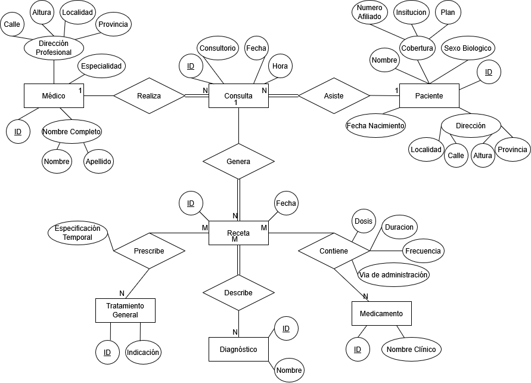

## 

## **Consigna 3**

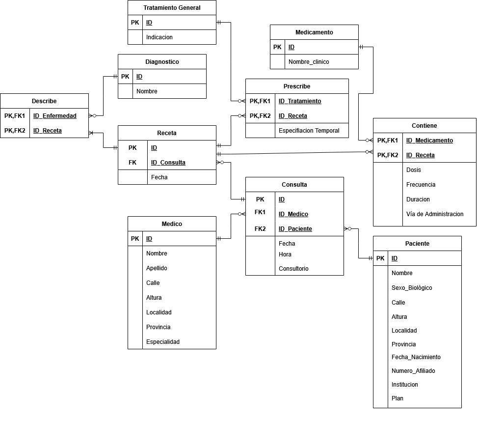

## **Consigna 4**

En el primer caso se viola la Primera Forma Normal (1FN), ya que el atributo “Teléfonos” no es atómico, dado que contiene múltiples valores en un mismo campo (“1111, 2222”). La 1FN establece que todos los atributos deben contener valores indivisibles, por lo que almacenar más de un teléfono en una misma celda genera problemas de consulta y actualización. Para cumplir con esta forma normal, sería necesario separar los teléfonos en una tabla independiente, de modo que cada fila contenga un único número. 

En el segundo caso se viola la Tercera Forma Normal (3FN), debido a la existencia de una dependencia transitiva. En particular, el atributo “CódigoPostal” depende de “Ciudad”, y no directamente de la clave primaria “PacienteID”. Esto implica que se cumple la relación PacienteID → Ciudad → CódigoPostal, lo cual introduce redundancia y posibles inconsistencias si cambia el código postal de una ciudad. Para resolverlo, se debería separar la información en dos tablas, una para pacientes y otra para ciudades con su correspondiente código postal. 

En el tercer caso se viola la Segunda Forma Normal (2FN), ya que la tabla posee una clave primaria compuesta (PacienteID, MédicoID) y existen dependencias parciales. Específicamente, el atributo “NombrePaciente” depende únicamente de PacienteID, mientras que “Especialidad” depende únicamente de MédicoID. La 2FN exige que todos los atributos no clave dependan de la totalidad de la clave primaria, por lo que estas dependencias parciales generan redundancia. La solución consiste en descomponer la tabla en entidades separadas para pacientes y médicos, junto con una tabla intermedia que represente la relación entre ambos. 

En el cuarto caso se viola la Cuarta Forma Normal (4FN), debido a la presencia de dependencias multivaluadas independientes. Un paciente puede tener múltiples enfermedades y, a su vez, múltiples medicamentos, pero no necesariamente existe una relación directa entre cada enfermedad y cada medicamento. Al almacenarlos en una misma tabla, se generan combinaciones artificiales que no representan información real. Esto produce redundancia y posibles inconsistencias. Para cumplir con la 4FN, es necesario separar la información en dos tablas distintas: una que relacione pacientes con enfermedades y otra que relacione pacientes con medicamentos. 

# 

# 

# 

# 

# 

# 

# 

# 

# 

# 

# 

# 

# 

# Parte 2

## **Consigna 1: Optimización de consultas por ciudad mediante índice**

Al agrupar la tabla Pacientes por ciudad sin un índice, el motor de base de datos realiza un escaneo completo de la tabla (full table scan), recorriendo cada fila una por una. Esto se vuelve muy lento a medida que la tabla crece. La solución es crear un índice sobre la columna ciudad: una estructura auxiliar que permite al motor acceder directamente a los grupos sin leer toda la tabla.

 

CREATE INDEX idx\_pacientes\_ciudad ON Pacientes(ciudad);

## **Consigna 2: Cálculo dinámico de edad mediante una Vista (VIEW)**

La edad no puede almacenarse como valor fijo en la tabla porque cambia cada año. La solución es crear una VIEW que la calcule en tiempo real cada vez que se consulta. Una vista es una consulta guardada que se comporta como una tabla virtual: no almacena datos, los genera en el momento.

 

CREATE VIEW vista\_pacientes AS  
SELECT  
	id\_paciente,  
	nombre,  
	fecha\_nacimiento,  
	EXTRACT(YEAR FROM AGE(CURRENT\_DATE, fecha\_nacimiento)) AS edad,  
	ciudad,  
	calle,  
	numero  
FROM Pacientes;

 

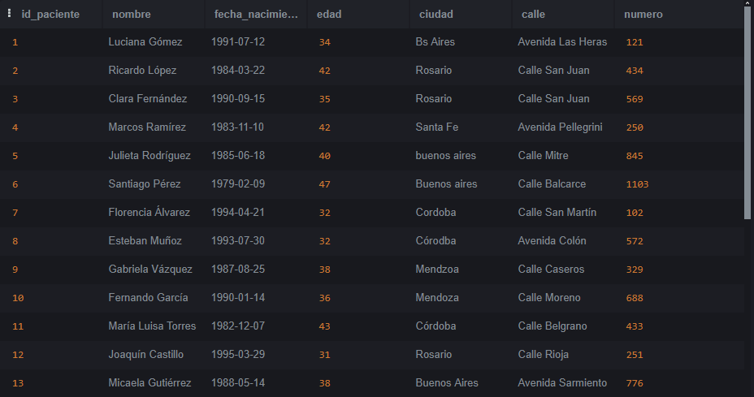

## **Consigna 3: Pacientes menores de edad**

 

SELECT nombre, edad  
FROM vista\_pacientes  
WHERE edad \< 18;

 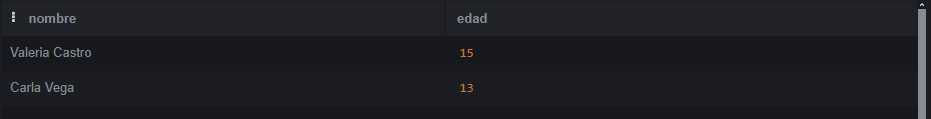

## **Consigna 4: Actualización de dirección de Luciana Gómez**

UPDATE Pacientes  
SET calle \= 'Calle Corrientes', numero \= '500', ciudad \= 'Buenos Aires'  
WHERE nombre \= 'Luciana Gómez';

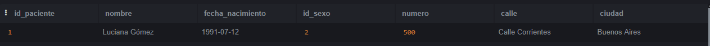

## 

## **Consigna 5: Médicos con especialidad ID \= 4 (Dermatología)**

 

SELECT nombre, matricula  
FROM Medicos  
WHERE especialidad\_id \= 4;

 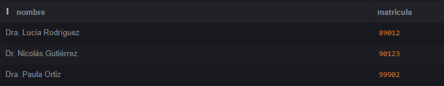

## **Consigna 6: Pacientes que viven en Buenos Aires**

Dado que los datos presentan inconsistencias en la escritura de la ciudad (ver consigna 7), se utiliza UPPER() y LIKE con comodines para capturar todas las variantes posibles. Se recomienda ejecutar esta consulta después de normalizar los datos con los UPDATE de la consigna 7\.

 

SELECT nombre, calle, numero, ciudad  
FROM Pacientes  
WHERE UPPER(ciudad) LIKE '%BUENOS AIRES%';

 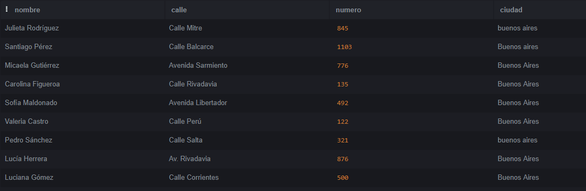

## 

## **Consigna 7: Corrección de inconsistencias en nombres de ciudades**

Los datos contienen errores tipográficos y variaciones de escritura: 'buenos aires', 'Bs Aires', 'Buenos   Aires', 'Córodba', 'Mendzoa', entre otros. Se aplican UPDATE con UPPER() y TRIM() para normalizar mayúsculas y espacios, y LIKE con comodines para capturar variantes. Los casos con typos específicos se corrigen con igualdad exacta.

 

UPDATE Pacientes SET ciudad \= 'Buenos Aires'  
WHERE UPPER(TRIM(ciudad)) LIKE '%BUENOS AIRES%'  
   OR UPPER(TRIM(ciudad)) LIKE '%BS AIRES%';  
   
UPDATE Pacientes SET ciudad \= 'Buenos Aires'  
WHERE ciudad \= 'Buenos Aiers';  
   
UPDATE Pacientes SET ciudad \= 'Buenos Aires'  
WHERE id\_paciente \= 14;  
   
UPDATE Pacientes SET ciudad \= 'Córdoba'  
WHERE UPPER(TRIM(ciudad)) LIKE '%C\_RDOBA%'  
   OR ciudad \= 'Córodba';  
   
UPDATE Pacientes SET ciudad \= 'Mendoza'  
WHERE UPPER(TRIM(ciudad)) LIKE '%MENDOZA%'  
   OR ciudad \= 'Mendzoa';  
   
UPDATE Pacientes SET ciudad \= 'Rosario'  
WHERE UPPER(TRIM(ciudad)) LIKE '%ROSARIO%';  
   
UPDATE Pacientes SET ciudad \= 'Santa Fe'  
WHERE UPPER(TRIM(ciudad)) LIKE '%SANTA FE%';

 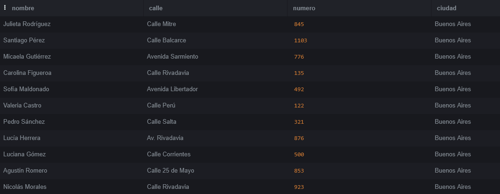

## 

## **Consigna 8: Cantidad de pacientes por ciudad**

 

SELECT ciudad, COUNT(\*) AS cantidad\_pacientes  
FROM Pacientes  
GROUP BY ciudad  
ORDER BY cantidad\_pacientes DESC;

 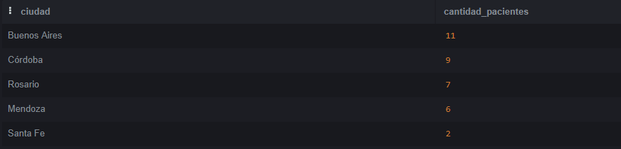

## **Consigna 9: Cantidad de pacientes por sexo en cada ciudad**

Se requiere un JOIN con la tabla SexoBiologico porque en Pacientes solo se almacena el id\_sexo (1 o 2). El texto descriptivo 'Masculino'/'Femenino' está en la tabla auxiliar.

 

SELECT p.ciudad, s.descripcion AS sexo, COUNT(\*) AS cantidad  
FROM Pacientes p  
INNER JOIN SexoBiologico s ON p.id\_sexo \= s.id\_sexo  
GROUP BY p.ciudad, s.descripcion  
ORDER BY p.ciudad;

 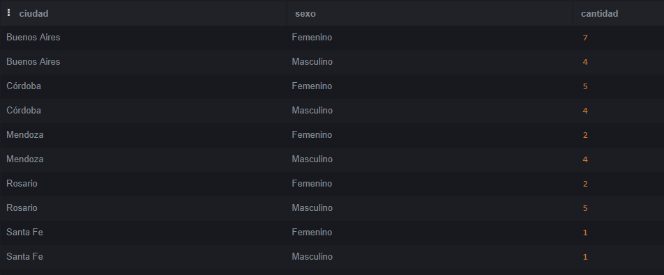

## 

## **Consigna 10: Cantidad de recetas emitidas por cada médico**

 

SELECT m.nombre, COUNT(r.id\_receta) AS total\_recetas  
FROM Medicos m  
LEFT JOIN Recetas r ON r.id\_medico \= m.id\_medico  
GROUP BY m.id\_medico, m.nombre   
ORDER BY total\_recetas DESC;

 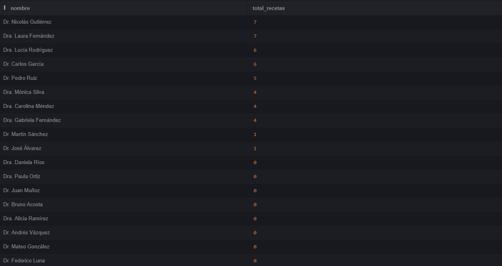

## **Consigna 11: Consultas del médico ID=3 en agosto 2024**

 

SELECT \*  
FROM Consultas  
WHERE id\_medico \= 3  
AND fecha BETWEEN '2024-08-01' AND '2024-08-31';

 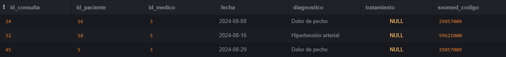

## 

## **Consigna 12: Pacientes con diagnóstico en consultas de agosto 2024**

 

SELECT p.nombre, c.fecha, c.diagnostico  
FROM Consultas c  
INNER JOIN Pacientes p ON c.id\_paciente \= p.id\_paciente  
WHERE c.fecha BETWEEN '2024-08-01' AND '2024-08-31';

 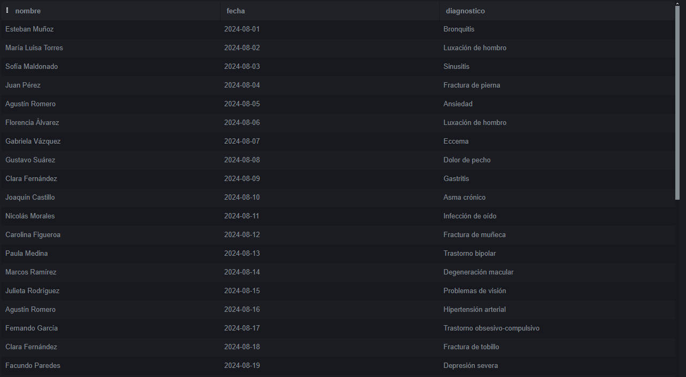

## **Consigna 13: Medicamentos recetados más de una vez por el médico ID=2**

Se usa HAVING en lugar de WHERE porque el filtro se aplica sobre el resultado de una agregación (COUNT). WHERE filtra filas individuales antes de agrupar; HAVING filtra grupos después de agrupar.

 

SELECT m.nombre, COUNT(\*) AS veces\_recetado  
FROM Recetas r  
JOIN Medicamentos m ON r.id\_medicamento \= m.id\_medicamento  
WHERE r.id\_medico \= 2  
GROUP BY m.id\_medicamento, m.nombre  
HAVING veces\_recetado \> 1;

 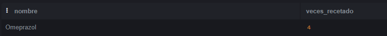

## 

## **Consigna 14: Pacientes con cantidad total de recetas recibidas**

 

SELECT p.nombre, COUNT(r.id\_receta) AS total\_recetas  
FROM Pacientes p  
LEFT JOIN Recetas r ON p.id\_paciente \= r.id\_paciente  
GROUP BY p.id\_paciente, p.nombre  
ORDER BY total\_recetas DESC;

 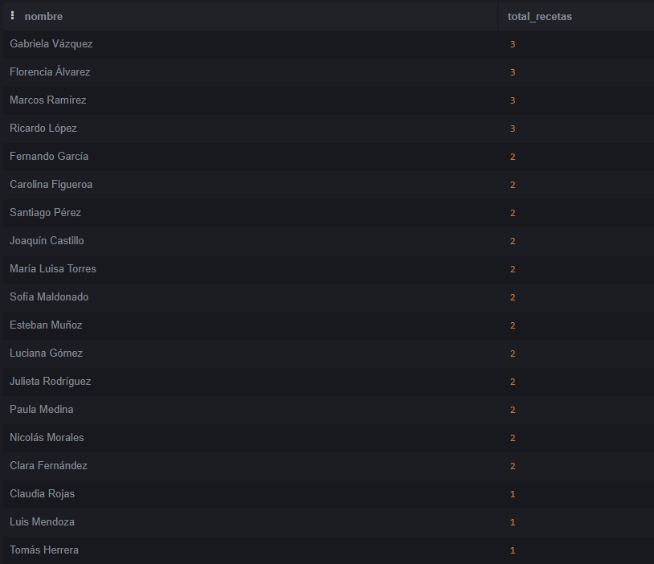

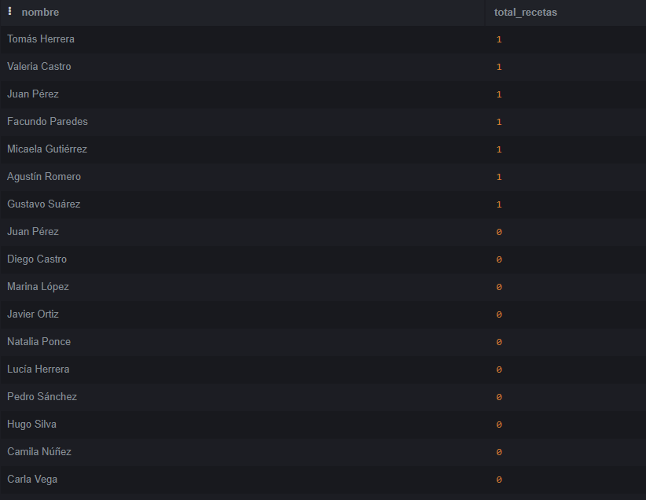

## **Consigna 15: Medicamento más recetado**

Se ordena de mayor a menor y se limita el resultado a 1 fila con LIMIT 1, obteniendo directamente el medicamento con más recetas.

 

SELECT m.nombre, COUNT(\*) AS total\_recetas  
FROM Recetas r  
INNER JOIN Medicamentos m ON r.id\_medicamento \= m.id\_medicamento  
GROUP BY m.id\_medicamento, m.nombre  
ORDER BY total\_recetas DESC  
LIMIT 1;

 

## 

## **Consigna 16: Pacientes con fecha de última consulta y diagnóstico**

Se utiliza una subconsulta correlacionada: para cada fila de Consultas, se busca la fecha máxima de ese mismo paciente. Solo se devuelven las filas cuya fecha coincide con esa máxima, garantizando que sea la última consulta.

 

SELECT DISTINCT ON (p.id\_paciente)   
p.nombre, c.fecha, c.diagnostico  
FROM pacientes p  
INNER JOIN consultas c ON p.id\_paciente \= c.id\_paciente  
ORDER BY p.id\_paciente, c.fecha DESC;

 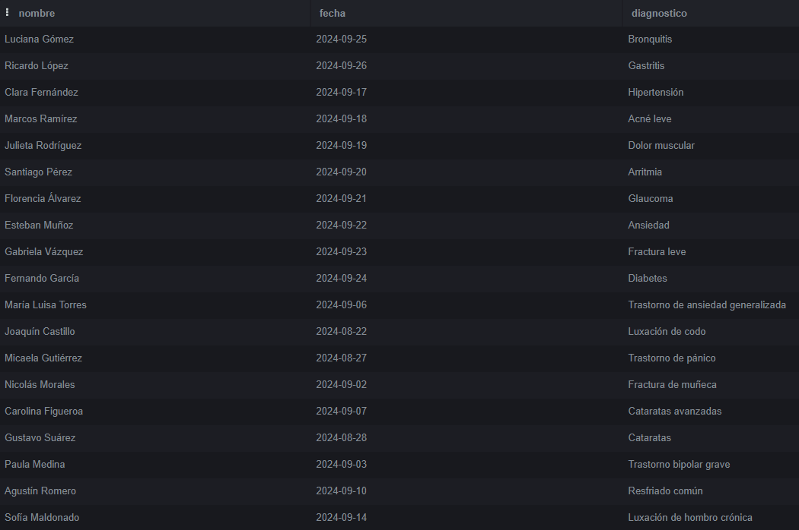

## 

## 

## 

## **Consigna 17: Total de consultas por par médico-paciente**

 

SELECT m.nombre AS medico, p.nombre AS paciente, COUNT(\*) AS total\_consultas  
FROM Consultas c  
INNER JOIN Medicos m ON c.id\_medico \= m.id\_medico  
INNER JOIN Pacientes p ON c.id\_paciente \= p.id\_paciente  
GROUP BY m.id\_medico, m.nombre, p.id\_paciente, p.nombre  
ORDER BY m.nombre, m.id\_medico, p.nombre, p.id\_paciente;

 

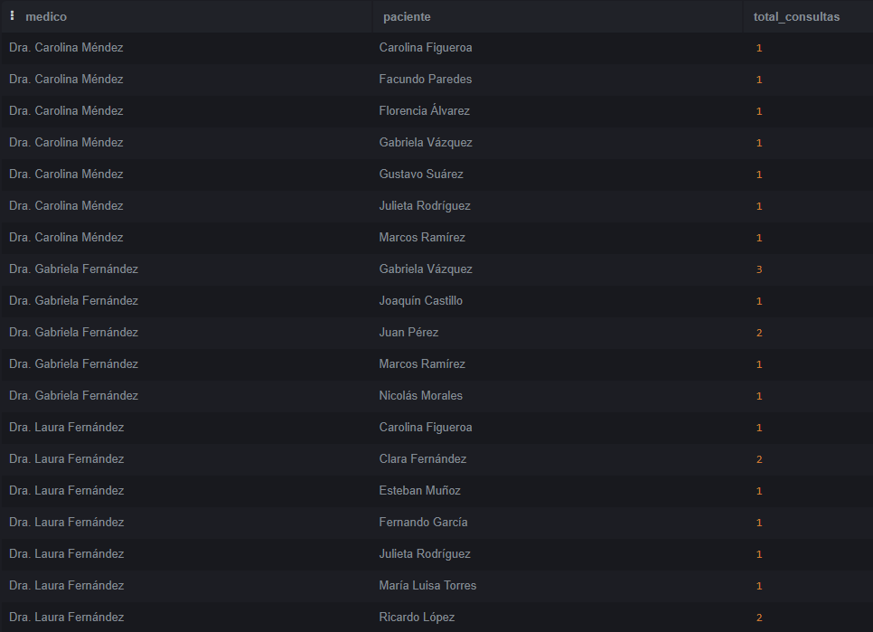

## 

## 

## **Consigna 18: Medicamentos con total de recetas, médico y paciente**

 

SELECT   
med.nombre AS medicamento,   
COUNT(\*) AS total\_recetas,   
m.nombre AS medico,   
p.nombre AS paciente   
FROM Recetas r   
INNER JOIN Medicamentos med ON r.id\_medicamento \= med.id\_medicamento   
INNER JOIN Medicos m ON r.id\_medico \= m.id\_medico   
INNER JOIN Pacientes p ON r.id\_paciente \= p.id\_paciente   
GROUP BY   
med.id\_medicamento, med.nombre,   
m.id\_medico, m.nombre, p.id\_paciente, p.nombre   
ORDER BY total\_recetas DESC; 

 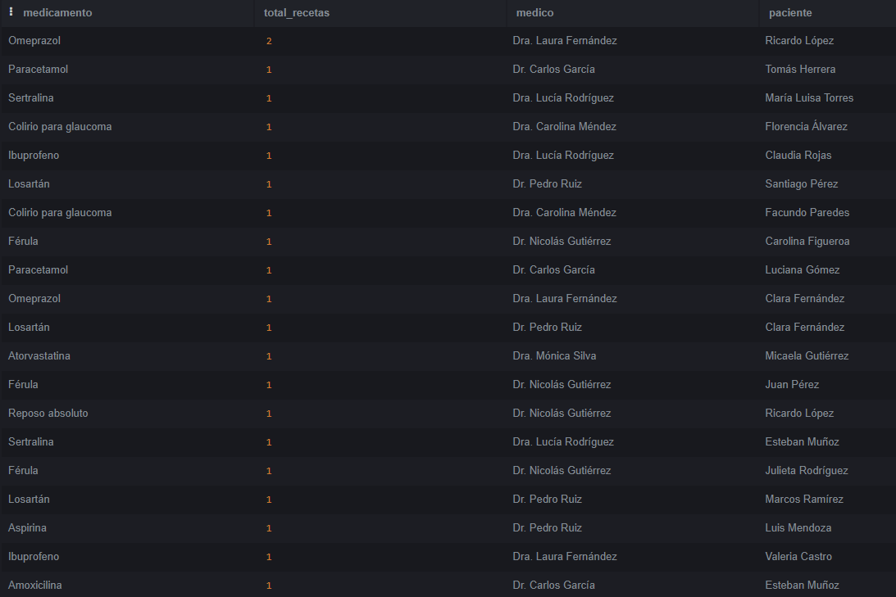

## 

## 

## **Consigna 19: Médicos con total de pacientes atendidos**

Se usa COUNT(DISTINCT id\_paciente) para contar pacientes únicos. Sin DISTINCT, si un médico atendió al mismo paciente en 5 consultas, contaría 5\. Con DISTINCT cuenta 1\.

 

SELECT m.nombre, COUNT(DISTINCT c.id\_paciente) AS total\_pacientes   
FROM Medicos m   
LEFT JOIN Consultas c ON m.id\_medico \= c.id\_medico   
GROUP BY m.id\_medico, m.nombre   
ORDER BY total\_pacientes DESC; 

 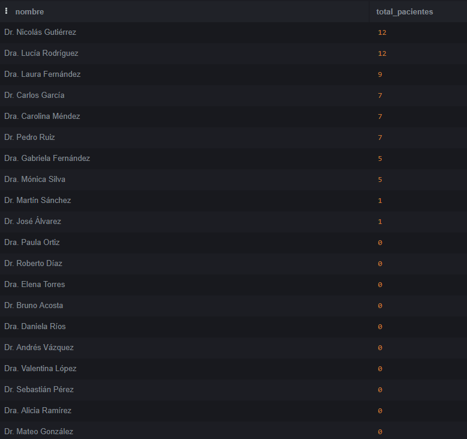

## 

## 

## 

## **Consigna 20: Consultas a menores de edad por médico**

La edad se calcula respecto a la fecha de la consulta, no la fecha actual. Esto es clínicamente correcto: interesa saber si el paciente era menor en el momento de la atención, no si lo es hoy.

 

SELECT m.nombre, COUNT(c.id\_consulta) AS consultas\_menores  
FROM Medicos m  
LEFT JOIN Consultas c ON m.id\_medico \= c.id\_medico  
LEFT JOIN Pacientes p ON c.id\_paciente \= p.id\_paciente  
AND EXTRACT(YEAR FROM AGE(c.fecha, p.fecha\_nacimiento)) \< 18  
GROUP BY m.id\_medico, m.nombre  
ORDER BY consultas\_menores DESC;

 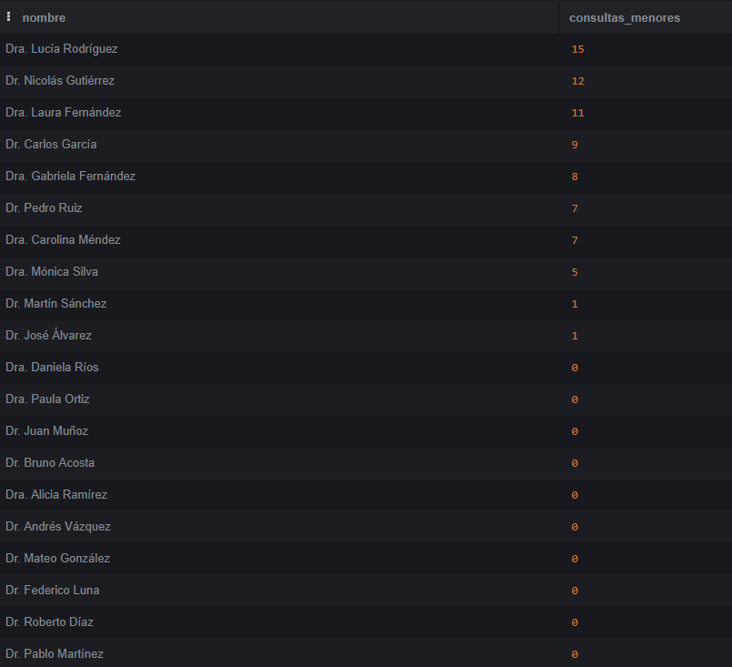

